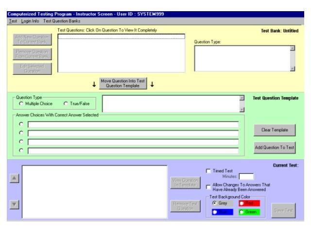



## \[a computerized test create/taker

### Description

Allows teachers and students to login. (To login the first time use user ID: system999 and password: sys99 - you will be logged in as a teacher and then you can create teacher login accounts). Teachers are allowed to create and edit tests and test banks, create and edit student accounts, and print tests and keys, and print test scores. Students will be allowed to take tests online and have their tests graded, along with changing their passwords.
 
### More Info
 
Too many inputs to mention

Too many returns to mention

Do not use double quotes in the text of your questions. Instead use single quotes.

             |
---                |---
**Submitted On**   |2001-05-04 11:57:36
**By**             |[Richard Jackson](https://github.com/Planet-Source-Code/PSCIndex/blob/master/ByAuthor/richard-jackson.md)
**Level**          |Advanced
**User Rating**    |4.6 (187 globes from 41 users)
**Compatibility**  |VB 6\.0
**Category**       |[Complete Applications](https://github.com/Planet-Source-Code/PSCIndex/blob/master/ByCategory/complete-applications__1-27.md)
**World**          |[Visual Basic](https://github.com/Planet-Source-Code/PSCIndex/blob/master/ByWorld/visual-basic.md)
**Archive File**   |[computeriz19222552001\.zip](https://github.com/Planet-Source-Code/richard-jackson-a-computerized-test-create-taker__1-22956/archive/master.zip)

